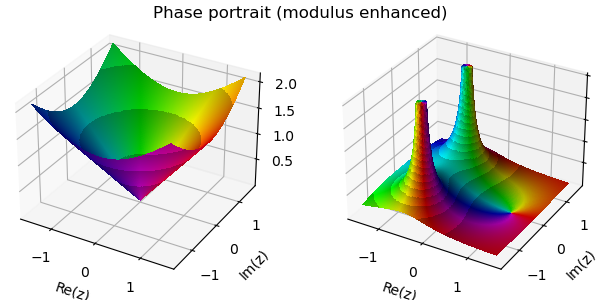
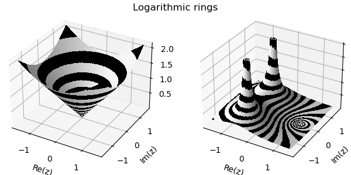

# Complexplorer

Complexplorer is a Python library for visualization of complex functions. 
The library was insipred by Elias Wegert's book ["Visual Complex Functions - An Introduction with Phase Portraits"](https://link.springer.com/book/10.1007/978-3-0348-0180-5) and it greatly benefitted from discussions and feedback that Elias kindly provided.

The library provides classes and functions to:  

* Create complex domains and corresponding complex-valued 2D arrays (meshes)
* Convert complex-valued 2D arrays to HSV and RGB color maps according to various schemes (Enhanced Phase Portrait, Chessboard, PolarChessboard, LogRings)
* Visualize complex-valued 2D arrays as 2D and 3D plots (2D image, 3D analytic landscape, 3D Riemann sphere)

Design choices of this library enable:  

* Simple composability: any domain can be used with any plot and any color map, yielding a multitude of different visualizations.
* Deferred evaluation of domain meshes. Meshing is typically performed during plotting (and not during domain instanciation). This allows for quick iteration of mesh period for best visual results.
* Different domain instances can be composed using union and intersection operations to create complex domains.

One exception from the composability ideal is Riemann sphere 3D plot. It has its own meshing algorithm to balance point density between the poles and equator.

Complexplorer is designed to be very light-weight in terms of its dependencies. It requires only numpy and matplotlib, which comes at a cost. 
Matplotlib is not a 3D rendering library, so 3D visualizations are painfully slow. This is especially true for Riemann sphere plot which uses 
a custom rectangular mesh that wastes a lot of points at the poles. A triangular mesh would be the right tool here, but I have not figured out how to achieve arbitrary point coloring in matplotlib.

## Library overview

The library contains following classes and functions.

### Domains

* `Domain`: This class serves as the base class for defining complex domains. It encapsulates 
the meshing and masking functionality of a `Domain` instance.

* `Rectangle`: A subclass of `Domain`, the `Rectangle` class allows the creation of rectangular domains centered at a given point. 
It takes the length (real and imaginary) of the rectangle and the center point as input.

* `Disk`: Another subclass of `Domain`, the `Disk` class enables the creation of circular domains (disks) centered at a given point.
It requires specifying the radius of the disk and the center point.

* `Annulus`: The `Annulus` class, also a subclass of `Domain`, enables the creation of annular domains (rings) centered at a given point.
It requires specifying the inner and outer radii and the center point.

### Color maps

* `Cmap`: This class serves as a base class for color maps and defines 
an informal interface for child color map classes. It implements 
the `*.hsv()` and `*.rgb()` methods which are used to convert 
input complex values to HSV and RGB-valued arrays.

* `Phase`: This class implements a phase color map. It can be used
to generate regular phase color maps or enhanced phase color maps.

* `Chessboard`: This class implements a chessboard color map.

* `PolarChessboard`: This class implements a polar chessboard color map.

* `LogRings`: This class implements a logarithmic black and white rings color map.

### 2D plotting functions

* `plot`: plot complex function as pullback of the color map of the co-domain to the domain.

* `pair_plot`: plot color maps of the domain and the pullback of the co-domain of the function.

* `riemann_chart`: plot the phase portrait of a complex function projected from the Riemann hemisphere.

* `riemann_hemispheres`: plot a pair of phase portraits corresponding to the upper and lower hemispheres of the Riemann sphere.

### 3D plotting functions

* `plot_landscape`: plot a complex function as a 3D landscape on the complex plane.

* `pair_plot_landscape`: - plot analytic landscapes of the domain and the pullback of the co-domain of the function.

* `riemann`: plot a complex function as a phase portrait on the Riemann sphere.

## Example notebooks

* [Basic functionality overview](examples/plot_examples.ipynb)

* [Domains and color maps](examples/domains_cmaps.ipynb)

## Gallery

Examples below use a test function $f(z) = \frac{z - 1}{z^2 + z + 1}$, a standard example from ["Visual Complex Functions - An Introduction with Phase Portraits"](https://link.springer.com/book/10.1007/978-3-0348-0180-5). Different color maps and plot types are shown. For the code used to generate these plots see this [example Jupyter notebook](examples/plot_examples.ipynb)

### Phase portraits (domain and co-domain side-by-side)

### Analytic landscapes  (domain and co-domain side-by-side)

### 2D Riemann chart (projected hemispheres)

### Riemann sphere

