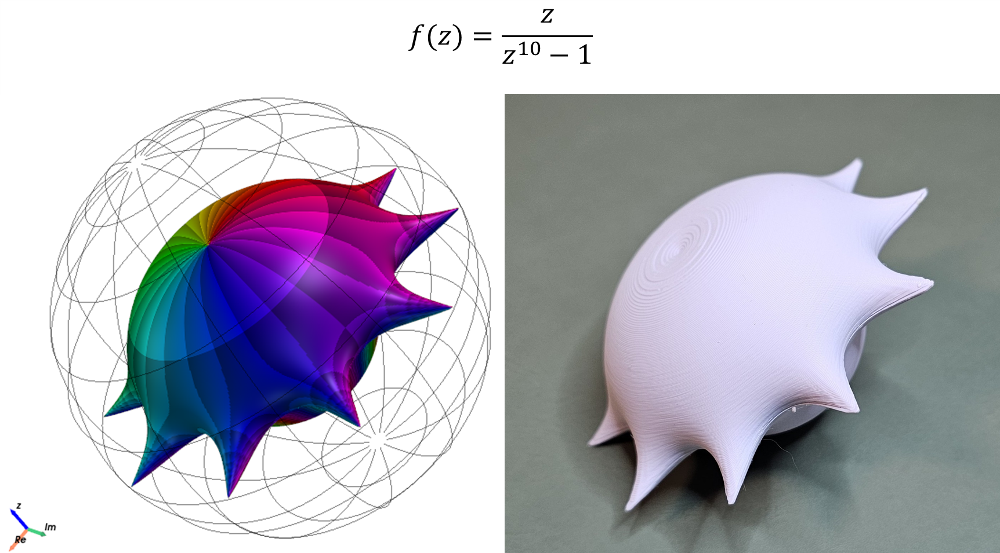

# Complexplorer

[](https://badge.fury.io/py/complexplorer)
[](https://pypi.org/project/complexplorer/)
[](https://opensource.org/licenses/MIT)

**Transform complex mathematics into tangible art.** Complexplorer brings complex function visualization into the physical world through stunning Riemann relief maps and 3D-printable mathematical ornaments.

<p align="center">
  
  <br>
  <em>From mathematical function to physical sculpture: f(z) = z / (z**10 - 1)</em>
</p>

## 🌟 What Makes Complexplorer Unique

Unlike other domain coloring libraries, Complexplorer offers:

- **🎨 Riemann Relief Maps**: First library to offer modulus-scaled Riemann sphere visualizations that reveal the true topology of complex functions
- **🖨️ Direct STL Export**: Transform any complex function into a 3D-printable mathematical ornament
- **🚀 PyVista Integration**: 15-30x faster 3D rendering with cinema-quality output
- **🔧 Advanced Domain Composition**: Create complex domains through set operations (union, intersection, difference)
- **📊 Flexible Modulus Mapping**: 10+ scaling modes to highlight different function features

## 📦 Installation

**Requirements**: Python 3.11 or higher

```bash
pip install complexplorer

# Optional: For interactive matplotlib plots in CLI scripts
pip install "complexplorer[qt]"

# Optional: For high-performance 3D visualizations
pip install "complexplorer[pyvista]"

# Optional: Install everything
pip install "complexplorer[all]"
```

## 🚀 Quick Start - From Math to Matter

```python
import complexplorer as cp

# Define your complex function
f = lambda z: (z**2 - 1) / (z**2 + 1)

# Visualize as an interactive Riemann relief map
cp.riemann_pv(f, modulus_mode='arctan', resolution=800)

# Export as a 3D-printable mathematical ornament
from complexplorer.export.stl import OrnamentGenerator

ornament = OrnamentGenerator(f, resolution=200)
ornament.generate_and_save('my_mathematical_ornament.stl', size_mm=80)
```

The modulus scaling creates a topographic "relief" effect - poles become mountains, zeros become valleys, and the complex phase creates colorful contours. When 3D printed, these become beautiful mathematical ornaments that capture the essence of complex functions in physical form.

Create traditional domain coloring visualizations too:

```python
# Classic phase portrait
domain = cp.Rectangle(4, 4)
cp.plot(domain, f, cmap=cp.Phase(n_phi=12, auto_scale_r=True))
```

## 💫 The Magic of Complex Numbers

*We cannot directly see the minute details of a Dedekind cut, nor is it clear that arbitrarily great or
arbitrarily tiny times or lengths actually exist in nature. One could say that 
the so-called 'real numbers' are as much a product of mathematicians' 
imaginations as are the complex numbers. Yet we shall find that complex 
numbers, as much as reals, and perhaps even more, find a unity with 
nature that is truly remarkable. It is as though Nature herself is as 
impressed by the scope and consistency of the complex-number system 
as we are ourselves, and has entrusted to these numbers the precise 
operations of her world at its minutest scales.* ...

*Moreover, to refer just to the scope and to the consistency of complex 
numbers does not do justice to this system. There is something more 
which, in my view, can only be referred to as 'magic'.*

[Road to Reality](https://www.ams.org/notices/200606/rev-blank.pdf), Chapter 4 - Magical Complex Numbers, Sir Roger Penrose

## 🎨 Gallery

Explore the full range of visualizations in our [**Gallery**](docs/gallery/README.md), featuring:
- Phase portraits with various enhancements
- Chessboard and polar patterns  
- 3D analytic landscapes
- Riemann relief maps and mathematical ornaments

<p align="center">
  <a href="docs/gallery/README.md">
    
    
    
  </a>
</p>

## 📚 Documentation

- **[Gallery](docs/gallery/README.md)** - Visual showcase with code examples
- **[Getting Started](examples/getting_started.ipynb)** - Beginner-friendly introduction
- **[Advanced Features](examples/advanced_features.ipynb)** - 3D visualization and more
- **[STL Export Demo](examples/stl_export_demo.ipynb)** - Create 3D printable models
- **[API Cookbook](examples/api_cookbook.ipynb)** - Ready-to-use code recipes
- **[Interactive Demo](examples/interactive_showcase.py)** - Run `python examples/interactive_showcase.py`
- **API Reference** - Use `help()` on any function or class

## 🛠️ Advanced Example

```python
# Create an enhanced phase portrait with auto-scaling for square cells
domain = cp.Annulus(0.5, 2, center=1j)  # Annular domain
cmap = cp.Phase(n_phi=6, auto_scale_r=True, v_base=0.4)  # Auto-scaled enhanced phase

# 2D visualization with domain and codomain side-by-side
cp.pair_plot(domain, f, cmap=cmap, figsize=(10, 5))

# 3D analytic landscape
cp.plot_landscape(domain, f, cmap=cmap, z_scale=0.3)

# 3D landscape with modulus scaling for better visualization
cp.plot_landscape(domain, f, cmap=cmap, modulus_mode='arctan')

# Riemann sphere projection
cp.riemann(f, resolution=800, cmap=cmap)
```

### 🚀 High-Performance Riemann Relief Maps with PyVista

Experience your complex functions in stunning detail with PyVista-powered visualizations that are 15-30x faster than traditional approaches:

```python
# Create an interactive Riemann relief map
cp.riemann_pv(f, modulus_mode='arctan', resolution=800, notebook=False)

# High-performance 3D landscape
cp.plot_landscape_pv(domain, f, cmap=cmap, notebook=False)

# Side-by-side domain and codomain relief maps
cp.pair_plot_landscape_pv(domain, f, cmap=cmap, window_size=(1600, 800))
```

**⚠️ Pro Tip:** For cinema-quality Riemann relief maps, use PyVista via command-line scripts rather than Jupyter notebooks. The CLI experience offers superior antialiasing and interactivity. Try `python examples/interactive_showcase.py` for the ultimate visualization experience!

### 📊 Modulus Scaling: The Secret to Beautiful Relief Maps

Control how the magnitude (modulus) of complex values creates the topography of your mathematical landscapes:

```python
# Different scaling modes for various visualization needs
cp.plot_landscape(domain, f, modulus_mode='constant')     # Phase only (flat)
cp.plot_landscape(domain, f, modulus_mode='arctan')       # Smooth bounded scaling
cp.plot_landscape(domain, f, modulus_mode='logarithmic')  # Emphasize poles/zeros
cp.plot_landscape(domain, f, modulus_mode='adaptive')     # Auto-adjust to data

# Custom scaling function for specific needs
def custom_scale(moduli):
    return np.tanh(moduli / 2)  # Custom transformation

cp.plot_landscape(domain, f, modulus_mode='custom', 
                 modulus_params={'scaling_func': custom_scale})
```

Available modes: `none`, `constant`, `linear`, `arctan`, `logarithmic`, `linear_clamp`, `power`, `sigmoid`, `adaptive`, `hybrid`, `custom`. See `examples/modulus_scaling_showcase.py` for comprehensive examples.

### 🎯 Domain Restrictions

Control numerical stability and focus visualizations on regions of interest by restricting to specific domains:

```python
# Avoid infinity at large distances
domain = cp.Disk(radius=5, center=0)
cp.riemann_pv(f, domain=domain, modulus_mode='arctan')

# Exclude origin for functions with poles
domain = cp.Annulus(inner_radius=0.1, outer_radius=10, center=0)
ornament = cp.OrnamentGenerator(func=lambda z: 1/z, domain=domain)
```

Domain restrictions work with all visualization functions and are especially useful for:
- Functions with essential singularities
- Focusing on specific regions of the complex plane
- Improving numerical stability in STL generation
- Creating cleaner 3D prints by excluding problematic areas

### 🖨️ 3D Printing: Mathematical Ornaments

Transform your Riemann relief maps into physical mathematical ornaments! Complexplorer is the first library to offer direct STL export of complex function visualizations:

```python
from complexplorer.export.stl import OrnamentGenerator

# Create a mathematical ornament from any complex function
ornament = OrnamentGenerator(
    func=lambda z: (z - 1) / (z**2 + z + 1),
    resolution=150,
    scaling='arctan',  # Creates beautiful topographic relief
    cmap=cp.Phase(n_phi=12, auto_scale_r=True)
)

# Generate print-ready STL file
ornament.generate_and_save('mathematical_ornament.stl', size_mm=80)
```

Features for perfect mathematical ornaments:
- **Automatic mesh healing** for watertight, printable models
- **Multiple scaling methods** to emphasize different mathematical features
- **Domain restrictions** to handle singularities gracefully
- **Optimized for FDM printing** - no supports needed
- **Compatible with all colormaps** for reference when painting

Your mathematical functions become conversation pieces - imagine gifting a physical representation of the Riemann zeta function or decorating with the beauty of elliptic functions!

See `examples/stl_export_demo.ipynb` for a complete guide to creating mathematical ornaments.

## 🤝 Contributing

Contributions are welcome! Please feel free to:
- Report bugs or suggest features via [Issues](https://github.com/kuvychko/complexplorer/issues)
- Submit pull requests with improvements
- Share your visualizations and examples
- Improve documentation

## 📖 Citation

If you use Complexplorer in your research, please cite:

```bibtex
@software{complexplorer,
  author = {Igor Kuvychko},
  title = {Complexplorer: A Python library for visualization of complex functions},
  url = {https://github.com/kuvychko/complexplorer},
  year = {2024}
}
```

## 🙏 Acknowledgments

This library was inspired by Elias Wegert's beautiful book ["Visual Complex Functions"](https://link.springer.com/book/10.1007/978-3-0348-0180-5) and benefited greatly from his feedback and suggestions.

## 📝 License

MIT License - see [LICENSE](LICENSE) file for details.