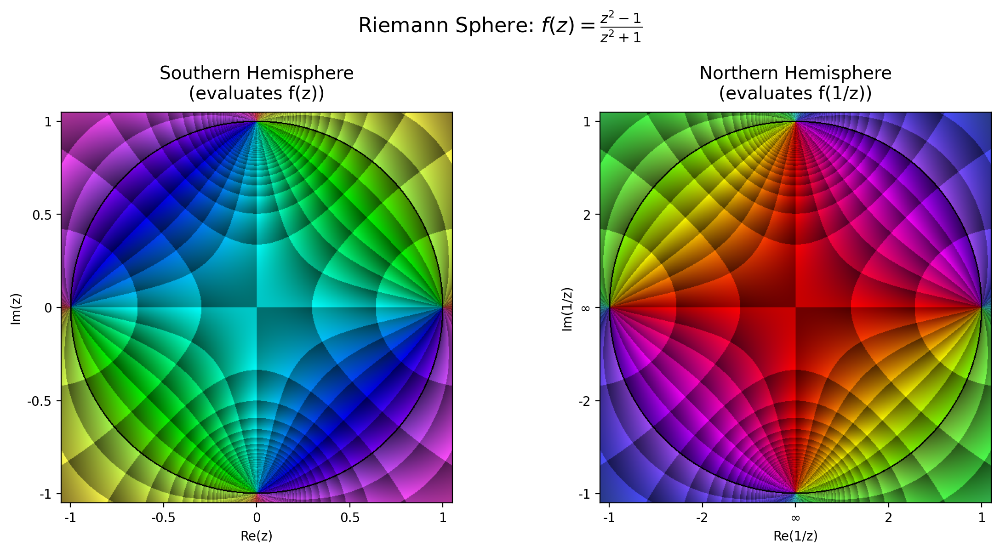

# Complexplorer

[](https://badge.fury.io/py/complexplorer)
[](https://pypi.org/project/complexplorer/)
[](https://opensource.org/licenses/MIT)

*We cannot directly see the minute details of a Dedekind cut, nor is it clear that arbitrarily great or
arbitrarily tiny times or lengths actually exist in nature. One could say that 
the so-called ‘real numbers’ are as much a product of mathematicians’ 
imaginations as are the complex numbers. Yet we shall find that complex 
numbers, as much as reals, and perhaps even more, find a unity with 
nature that is truly remarkable. It is as though Nature herself is as 
impressed by the scope and consistency of the complex-number system 
as we are ourselves, and has entrusted to these numbers the precise 
operations of her world at its minutest scales.* ...

*Moreover, to refer just to the scope and to the consistency of complex 
numbers does not do justice to this system. There is something more 
which, in my view, can only be referred to as ‘magic’.*

[Road to Reality](https://www.ams.org/notices/200606/rev-blank.pdf), Chapter 4 - Magical Complex Numbers, Sir Roger Penrose

**Complexplorer** is a Python library for elegant visualization of complex-valued functions. Create stunning phase portraits, analytic landscapes, and Riemann sphere projections with just a few lines of code.

<p align="center">
  
  
</p>

## ✨ Features

- **🎨 Rich visualization options**: Phase portraits, enhanced phase portraits, chessboard patterns, and more
- **🗺️ Flexible domains**: Rectangles, disks, annuli, and custom domains via composition
- **📊 Multiple plot types**: 2D images, 3D analytic landscapes, Riemann sphere projections
- **🧩 Composable design**: Mix any domain, color map, and plot type
- **🚀 Lightweight**: Requires only NumPy and Matplotlib

## 📦 Installation

**Requirements**: Python 3.11 or higher

```bash
pip install complexplorer
```

## 🚀 Quick Start

```python
import complexplorer as cp
import numpy as np

# Define a complex function
def f(z):
    return (z - 1) / (z**2 + z + 1)

# Create a domain
domain = cp.Rectangle(3, 3)

# Visualize!
cp.plot(domain, f)
```

## 🎨 Gallery

Explore the full range of visualizations in our [**Gallery**](docs/gallery/README.md), featuring:
- Phase portraits with various enhancements
- Chessboard and polar patterns  
- 3D analytic landscapes
- Riemann sphere projections

<p align="center">
  <a href="docs/gallery/README.md">
    
    
    
  </a>
</p>

## 📚 Documentation

- **[Gallery](docs/gallery/README.md)** - Visual showcase with code examples
- **[Tutorial: Plotting Functions](examples/plotting_tutorial.ipynb)** - Comprehensive plotting guide
- **[Tutorial: Domains & Color Maps](examples/domains_and_colormaps_tutorial.ipynb)** - Domain creation and color mapping
- **API Reference** - Use `help()` on any function or class

## 🛠️ Advanced Example

```python
# Create an enhanced phase portrait with custom parameters
domain = cp.Annulus(0.5, 2, center=1j)  # Annular domain
cmap = cp.Phase(n_phi=6, r_linear_step=0.4)  # Enhanced phase portrait

# 2D visualization with domain and codomain side-by-side
cp.pair_plot(domain, f, cmap=cmap, figsize=(10, 5))

# 3D analytic landscape
cp.plot_landscape(domain, func=f, cmap=cmap, z_max=10)

# Riemann sphere projection
cp.riemann(f, n=800, cmap=cmap)
```

### 🚀 High-Performance 3D Visualizations with PyVista

For interactive, high-quality 3D visualizations, Complexplorer includes PyVista-based plotting functions:

```python
# High-performance 3D landscape
cp.plot_landscape_pv(domain, f, cmap=cmap, show_orientation=True)

# Interactive Riemann sphere with modulus scaling
cp.riemann_pv(f, scaling='arctan', show_orientation=True)
```

**⚠️ Important Note:** For best quality, we strongly recommend using PyVista visualizations via command-line scripts rather than Jupyter notebooks. The Jupyter backend (trame) has significant aliasing issues that cannot be compensated with higher resolution. See `examples/interactive_demo.py` for an excellent CLI-based interactive experience.

## 🤝 Contributing

Contributions are welcome! Please feel free to:
- Report bugs or suggest features via [Issues](https://github.com/kuvychko/complexplorer/issues)
- Submit pull requests with improvements
- Share your visualizations and examples
- Improve documentation

## 📖 Citation

If you use Complexplorer in your research, please cite:

```bibtex
@software{complexplorer,
  author = {Igor Kuvychko},
  title = {Complexplorer: A Python library for visualization of complex functions},
  url = {https://github.com/kuvychko/complexplorer},
  year = {2024}
}
```

## 🙏 Acknowledgments

This library was inspired by Elias Wegert's beautiful book ["Visual Complex Functions"](https://link.springer.com/book/10.1007/978-3-0348-0180-5) and benefited greatly from his feedback and suggestions.

## 📝 License

MIT License - see [LICENSE](LICENSE) file for details.