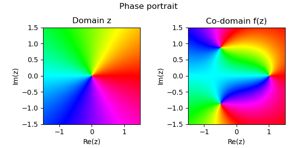
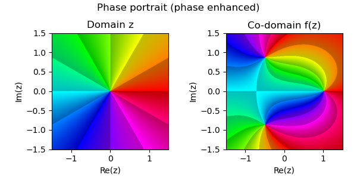
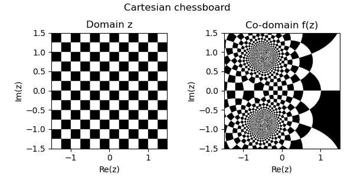
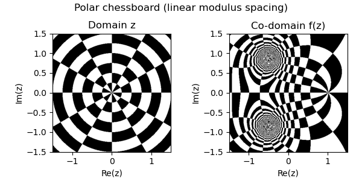
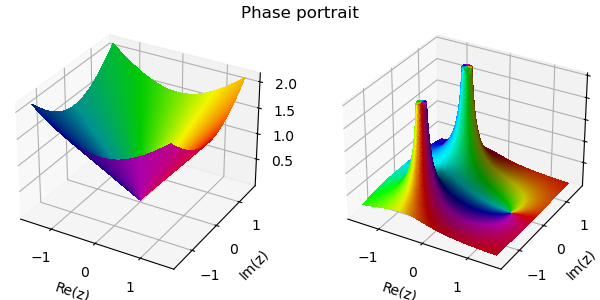
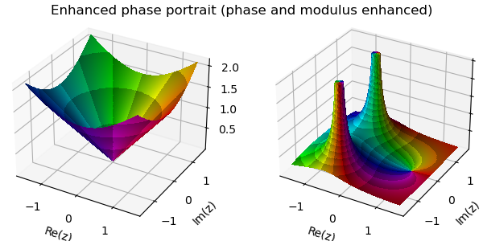
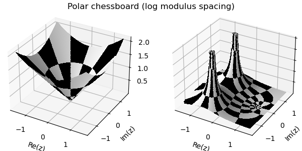

# Complexplorer Gallery

This gallery showcases various visualizations possible with the complexplorer library. All examples use the test function $f(z) = \frac{z - 1}{z^2 + z + 1}$ from Elias Wegert's book "Visual Complex Functions".

## 2D Visualizations

### Phase Portraits

Phase portraits map the phase (argument) of complex numbers to colors, creating beautiful visualizations that reveal the structure of complex functions.

#### Basic Phase Portrait

```python
import complexplorer as cp
domain = cp.Rectangle(3, 3)
func = lambda z: (z - 1) / (z**2 + z + 1)
cp.pair_plot(domain, func, cmap=cp.Phase())
```

#### Enhanced Phase Portrait (Phase Enhancement)

```python
cp.pair_plot(domain, func, cmap=cp.Phase(n_phi=6))
```

#### Enhanced Phase Portrait (Modulus Enhancement)

```python
cp.pair_plot(domain, func, cmap=cp.Phase(r_linear_step=0.6))
```

#### Enhanced Phase Portrait (Phase and Modulus)

```python
cp.pair_plot(domain, func, cmap=cp.Phase(n_phi=6, r_linear_step=0.6))
```

### Chessboard Patterns

Chessboard patterns help visualize how complex functions transform regular grids.

#### Cartesian Chessboard

```python
cp.pair_plot(domain, func, cmap=cp.Chessboard(spacing=0.25))
```

#### Polar Chessboard (Linear Spacing)

```python
cp.pair_plot(domain, func, cmap=cp.PolarChessboard(n_phi=6, r_spacing=0.25))
```

#### Polar Chessboard (Logarithmic Spacing)

```python
cp.pair_plot(domain, func, cmap=cp.PolarChessboard(n_phi=6, r_log=np.e))
```

### Special Patterns

#### Logarithmic Rings

```python
cp.pair_plot(domain, func, cmap=cp.LogRings(log_spacing=0.2))
```

## 3D Visualizations

### Analytic Landscapes

3D landscapes show the modulus (absolute value) of complex functions as height, with colors representing the phase.

#### Phase Portrait Landscape

```python
cp.pair_plot_landscape(domain, func, cmap=cp.Phase())
```

#### Enhanced Phase Portrait Landscape

```python
cp.pair_plot_landscape(domain, func, cmap=cp.Phase(n_phi=6, r_linear_step=0.6))
```

#### Polar Chessboard Landscape

```python
cp.pair_plot_landscape(domain, func, cmap=cp.PolarChessboard(n_phi=6, r_log=np.e))
```

### Riemann Sphere Visualizations

The Riemann sphere provides a way to visualize complex functions over the entire extended complex plane, including the point at infinity.

#### 2D Riemann Chart (Hemispheres)

```python
cp.riemann_hemispheres(func)
```

#### 3D Riemann Sphere

```python
cp.riemann(func, n=600, cmap=cp.Phase(n_phi=6, r_linear_step=1))
```

## Understanding the Visualizations

### Color Mapping
- **Hue (color)**: Represents the phase (argument) of the complex number
- **Brightness**: Can represent the modulus in enhanced portraits
- **Saturation**: Usually constant, but can be modified

### Common Features to Look For
- **Zeros**: Points where colors converge (like color wheels)
- **Poles**: Points where colors diverge
- **Branch cuts**: Discontinuities in color
- **Critical points**: Where the function's derivative is zero

## Creating Your Own Visualizations

To experiment with your own functions:

```python
import complexplorer as cp
import numpy as np

# Define your domain
domain = cp.Rectangle(4, 4)  # 4x4 square centered at origin

# Define your function
def my_func(z):
    return np.sin(z) / z  # Example: sinc function

# Create visualizations
cp.plot(domain, my_func)  # Simple 2D plot
cp.plot_landscape(domain, func=my_func)  # 3D landscape
cp.riemann(my_func)  # Riemann sphere
```

## More Examples

For more detailed examples and explanations, see:
- [Basic functionality tutorial](../../examples/plots_example.ipynb)
- [Domains and color maps guide](../../examples/domains_cmaps_example.ipynb)
- [Mathematical background](../mathematical_background.md) (coming soon)