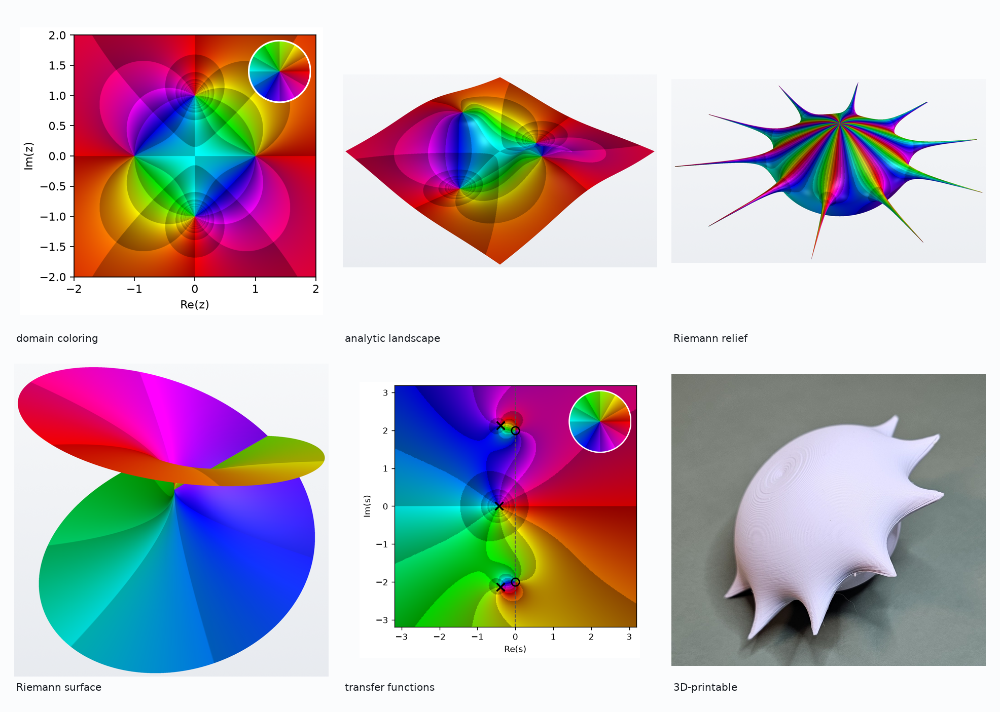

# Complexplorer Gallery

A visual tour of what complexplorer renders. Every image is generated from the curated preset
registry (`cp.catalog`) and the tour recipes, so each figure stays in step with the library and
reproduces from one command.

<p align="center">
  <a href="gallery.generated.md">
    
  </a>
</p>

## The gallery

**[Browse the full gallery](gallery.generated.md)** — organised by idea rather than by registry
order:

| Section | What it shows |
|---|---|
| Phase portraits | Hue as phase, contour bands as modulus; how to read the picture |
| Mapping and topology | Magnitude lifted into height, and the compactified plane |
| Riemann surfaces | Multivalued families on the cover where they become single-valued |
| Engineering mode | Transfer functions as complex functions: portrait, poles, Bode, Nyquist |
| Colormaps | One reference function under every colormap the package exports |
| Physical output | Modulus relief, the exported mesh, and the printed object |

Thumbnails link to the full-resolution render, each figure carries a short interpretation, and the
code that reproduces it sits in a collapsed block beneath.

## How it is produced

```bash
python examples/showcase.py                    # everything, into examples/gallery
python examples/showcase.py --only colormaps   # one section
python examples/showcase.py --out /tmp/round   # stage a round for review; the repo is untouched
```

The producer wraps the deterministic library generator (`cp.gallery`, which writes the 2D
portraits and the byte-stable `index.json` interchange manifest) and adds the PyVista screenshots
that manifest deliberately omits, the curated tour, the colormap gallery, thumbnails and the hero
montage. A presentation manifest (`examples/gallery/showcase.json`) records every render with the
profile and resolution behind it.

Render settings are not ad-hoc: `RENDER_PROFILES` in `examples/showcase.py` fixes one camera,
ground, lighting, finish and mesh resolution per family, so the gallery shares a single look.

> The generated page is written by the producer — edit `examples/showcase.py` or
> `examples/tour.py`, not `gallery.generated.md`. Snippets are registry-driven
> (`cp.catalog.get(<id>)`), so they run as shown against the current 3.0 API.

## Reproducing any single visualization

```python
import complexplorer as cp

preset = cp.catalog.get("pole_flower_10")   # f(z) = z / (z**10 - 1)
cp.plot(preset.domain(), preset.func, cmap=preset.colormap(), legend=True)   # 2D portrait
cp.riemann_pv(preset.func, cmap=preset.colormap())                           # Riemann sphere
```

See the [API Cookbook](../../examples/notebooks/api_cookbook.ipynb) for more patterns, and
[Visual Complex Functions](http://www.visual.wegert.com/) by Elias Wegert for the mathematics
behind phase portraits.
