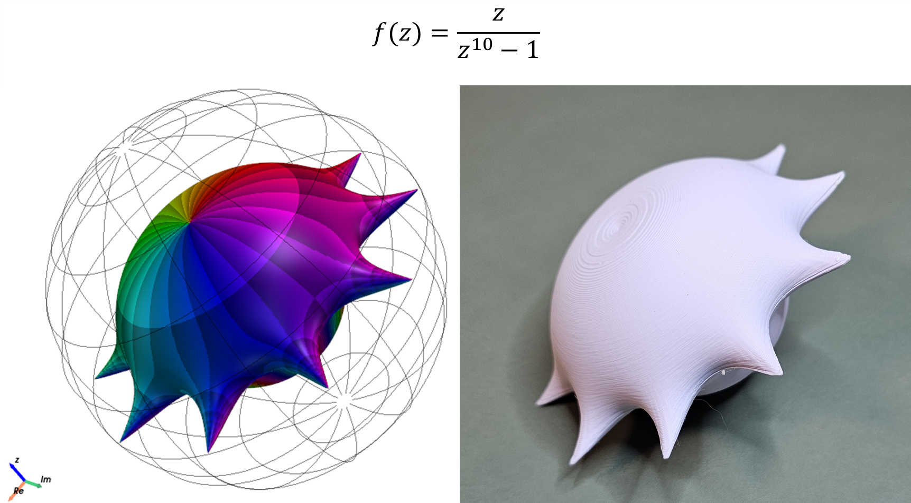

# Complexplorer Gallery

A visual tour of what complexplorer renders — generated from the curated preset registry
(`cp.catalog`), so every image and code snippet is reproducible and stays in step with the
library.

<p align="center">
  
  <br>
  <em>Riemann relief map of f(z) = z / (z¹⁰ − 1)</em>
</p>

## How this gallery is produced

The images are rendered by a single local command:

```bash
python examples/showcase.py
```

It wraps the deterministic library generator (`cp.gallery`, which writes the 2D portraits and
the byte-stable `index.json` interchange manifest), then adds the PyVista 3D screenshots —
analytic landscapes, Riemann spheres, Riemann **surfaces** of the multivalued families, and
relief renders — plus a colormap gallery. The render set for each function follows its catalog
*tags*, and a presentation manifest (`examples/gallery/showcase.json`) records every render.

## The gallery

➡️ **[Browse the full generated gallery](gallery.generated.md)** — every catalog function with
its phase portrait, 3D views, derived code snippet, and notes, followed by the colormap family
on a reference function.

> The gallery page is generated (`examples/showcase.py` writes `gallery.generated.md`); edit the
> producer, not the page. Code snippets are registry-driven (`cp.catalog.get(<id>)`), so they run
> as shown against the current 3.0 API.

## Reproducing any single visualization

Every gallery entry is a few lines against the registry, e.g.:

```python
import complexplorer as cp

preset = cp.catalog.get("pole_flower_10")   # f(z) = z / (z**10 - 1)
cp.plot(preset.domain(), preset.func, cmap=preset.colormap())   # 2D phase portrait
cp.riemann_pv(preset.func, cmap=preset.colormap(), domain=preset.domain())   # Riemann sphere
```

See the [API Cookbook](../../examples/notebooks/api_cookbook.ipynb) for more patterns, and
[Visual Complex Functions](http://www.visual.wegert.com/) by Elias Wegert for the mathematics
behind phase portraits.
