<!-- GENERATED by examples/showcase.py — do not edit by hand.
     Regenerate with:  python examples/showcase.py  -->

# Gallery

Every image here is produced by `examples/showcase.py` from the curated preset registry
(`cp.catalog`) and the tour recipes in `examples/tour.py`. Thumbnails link to the
full-resolution render.

<a href="../../examples/gallery/_tour/hero_labels_on_panel.png">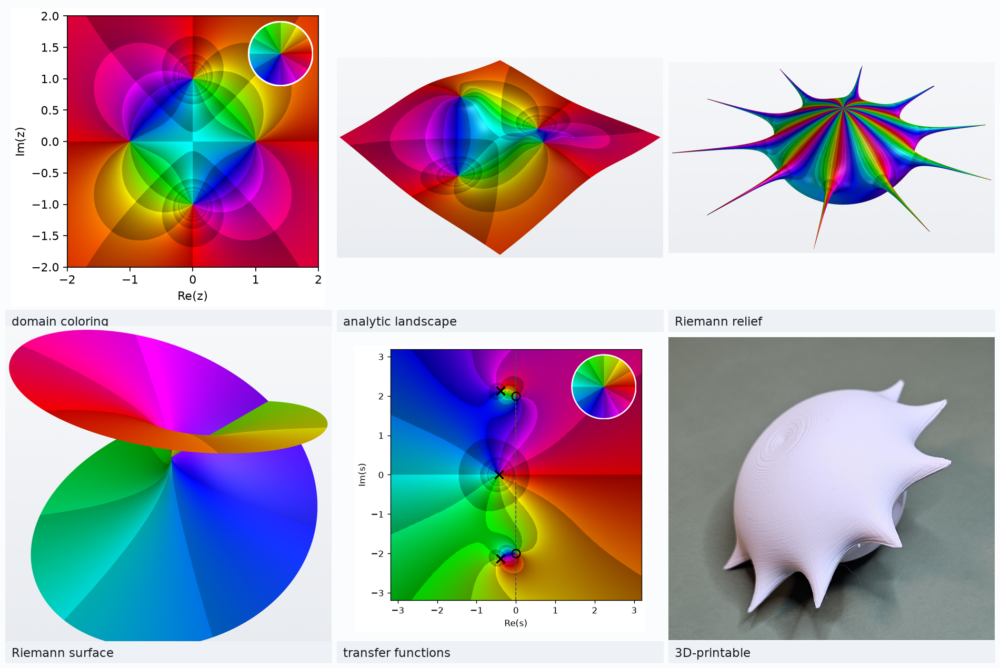</a>

## What is here

- [Phase portraits](#phase-portraits) — 8 figures
- [Mapping and topology](#mapping-and-topology) — 8 figures
- [Riemann surfaces](#riemann-surfaces) — 4 figures
- [Engineering mode](#engineering-mode) — 2 figures
- [Colormaps](#colormaps) — 17 figures
- [Physical output](#physical-output) — 3 figures

## Phase portraits

Hue is the phase of f(z); the shaded cells are contour bands of |f(z)|. Zeros and poles read as opposite winding directions.

### Reading a phase portrait

Hue is the phase of f(z) and the shaded cells are its contour bands, so zeros and poles read as opposite winding directions. The inset legend is the same colormap applied to the identity map, which is what makes the picture decodable.

<p><a href="../../examples/gallery/_tour/legend_portrait.png">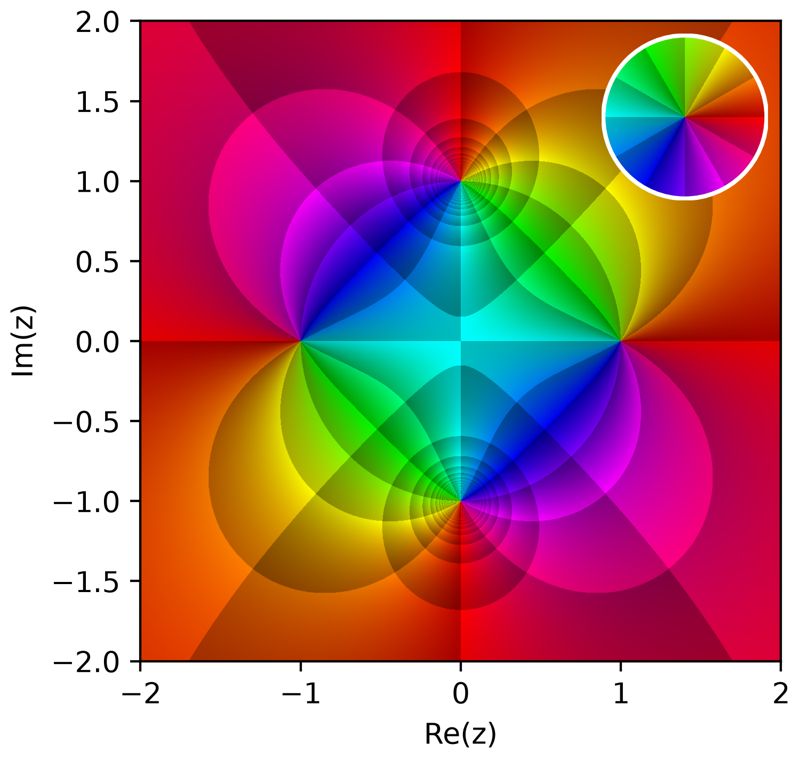</a></p>

<details>
<summary>Show the code</summary>

```python
import complexplorer as cp
preset = cp.catalog.get("rational_zeros_poles")
cp.plot(preset.domain(), preset.func, cmap=preset.colormap(), legend=True)
```

</details>

### Essential singularity

exp(1/z) has an essential singularity at 0 — infinitely dense structure nearby.

<p><a href="../../examples/gallery/essential_exp_inv/portrait.png"></a></p>

<details>
<summary>Show the code</summary>

```python
import complexplorer as cp
preset = cp.catalog.get("essential_exp_inv")   # f(z) = exp(1 / z)
cp.plot(preset.domain(), preset.func, cmap=preset.colormap())
```

</details>

### Exponential

Entire and never zero: no finite zeros or poles (an empty answer key).

<p><a href="../../examples/gallery/exp/portrait.png"></a></p>

<details>
<summary>Show the code</summary>

```python
import complexplorer as cp
preset = cp.catalog.get("exp")   # f(z) = exp(z)
cp.plot(preset.domain(), preset.func, cmap=preset.colormap())
```

</details>

### Newton map (z³ - 1)

The Newton iteration map for z³ - 1: an order-2 pole at 0 and three simple zeros at the cube roots of -1/2.

<p><a href="../../examples/gallery/newton_cubic/portrait.png"></a></p>

<details>
<summary>Show the code</summary>

```python
import complexplorer as cp
preset = cp.catalog.get("newton_cubic")   # f(z) = (2*z**3 + 1) / (3*z**2)
cp.plot(preset.domain(), preset.func, cmap=preset.colormap())
```

</details>

### Double pole

An order-2 pole at the origin; phase winds backward twice.

<p><a href="../../examples/gallery/pole_order_2/portrait.png"></a></p>

<details>
<summary>Show the code</summary>

```python
import complexplorer as cp
preset = cp.catalog.get("pole_order_2")   # f(z) = 1 / z**2
cp.plot(preset.domain(), preset.func, cmap=preset.colormap())
```

</details>

### Triple pole

An order-3 pole at the origin.

<p><a href="../../examples/gallery/pole_order_3/portrait.png"></a></p>

<details>
<summary>Show the code</summary>

```python
import complexplorer as cp
preset = cp.catalog.get("pole_order_3")   # f(z) = 1 / z**3
cp.plot(preset.domain(), preset.func, cmap=preset.colormap())
```

</details>

### Sine

Simple zeros at integer multiples of pi (−pi, 0, pi shown).

<p><a href="../../examples/gallery/sine/portrait.png"></a></p>

<details>
<summary>Show the code</summary>

```python
import complexplorer as cp
preset = cp.catalog.get("sine")   # f(z) = sin(z)
cp.plot(preset.domain(), preset.func, cmap=preset.colormap())
```

</details>

### Tangent

Zero at 0; simple poles at ±pi/2 (within the shown window).

<p><a href="../../examples/gallery/tangent/portrait.png"></a></p>

<details>
<summary>Show the code</summary>

```python
import complexplorer as cp
preset = cp.catalog.get("tangent")   # f(z) = tan(z)
cp.plot(preset.domain(), preset.func, cmap=preset.colormap())
```

</details>

## Mapping and topology

The same functions lifted off the plane: magnitude as height, and the sphere that compactifies the plane so infinity has a place to sit.

### From the plane to a landscape

The same function twice: flat, then with |f(z)| lifted into height. The zeros sink and the poles rise, while the colours stay put — the landscape adds magnitude without changing what the hue means.

<p><a href="../../examples/gallery/_tour/portrait_to_landscape.png">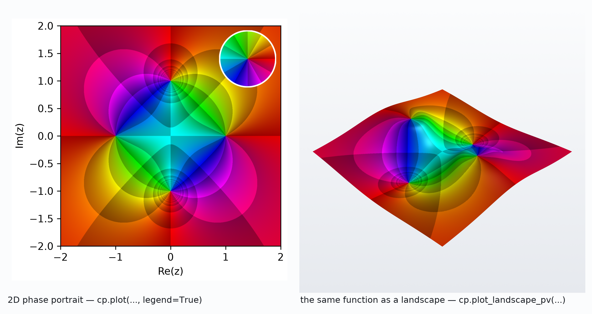</a></p>

<details>
<summary>Show the code</summary>

```python
import complexplorer as cp
preset = cp.catalog.get("rational_zeros_poles")
cp.plot(preset.domain(), preset.func, cmap=preset.colormap(), legend=True)
sc = preset.scaling()
cp.plot_landscape_pv(preset.domain(), preset.func, cmap=preset.colormap(),
                     modulus_mode=sc["method"], modulus_params=sc["params"])
```

</details>

### Domains compose

The outline is two overlapping disks unioned together, with a third punched out of the middle. Excluding a neighbourhood of the pole is not cosmetic: it keeps the huge values near z = 0 out of the sampling entirely.

<p><a href="../../examples/gallery/_tour/composite_domain.png">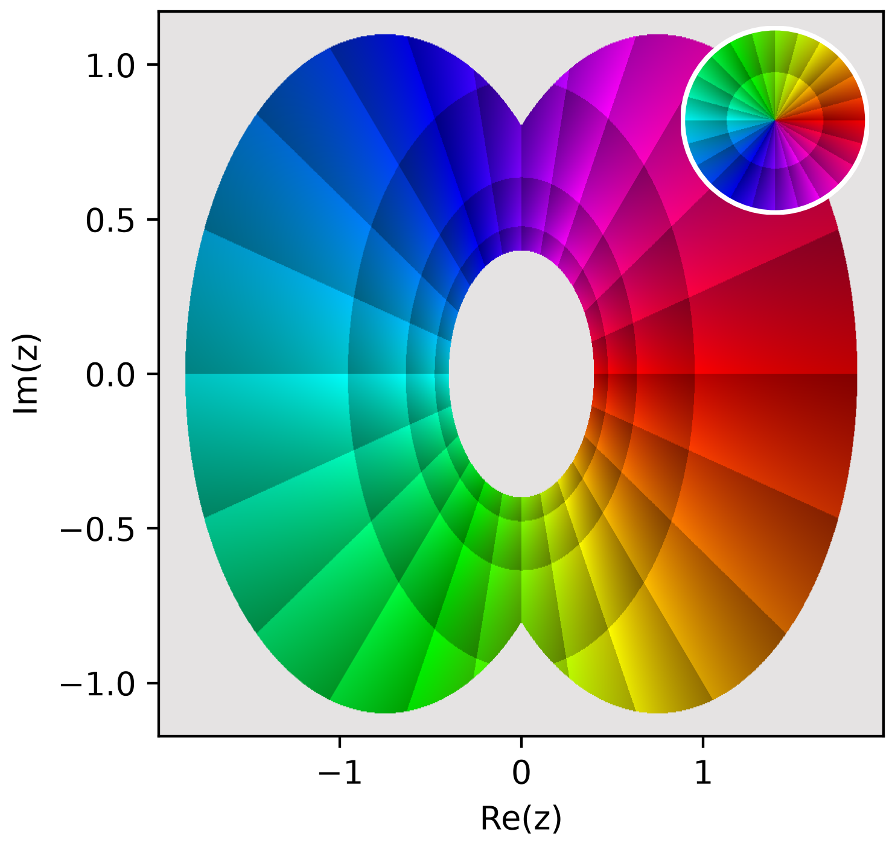</a></p>

<details>
<summary>Show the code</summary>

```python
import complexplorer as cp
domain = (cp.Disk(1.6, center=-0.7) & cp.Disk(1.6, center=0.7)) - cp.Disk(0.35)
cp.plot(domain, lambda z: 1 / z,
        cmap=cp.Phase(phase_sectors=12, auto_scale_r=True), legend=True)
```

</details>

### z³ - z

Three simple zeros at -1, 0, 1.

<p><a href="../../examples/gallery/cubic_real_roots/landscape.png"></a> <a href="../../examples/gallery/cubic_real_roots/portrait.png"></a> <a href="../../examples/gallery/cubic_real_roots/sphere.png"></a></p>

<details>
<summary>Show the code</summary>

```python
import complexplorer as cp
preset = cp.catalog.get("cubic_real_roots")   # f(z) = z**3 - z
sc = preset.scaling()
cp.plot_landscape_pv(preset.domain(), preset.func, cmap=preset.colormap(),
                     modulus_mode=sc["method"], modulus_params=sc["params"])

# ---
import complexplorer as cp
preset = cp.catalog.get("cubic_real_roots")   # f(z) = z**3 - z
cp.plot(preset.domain(), preset.func, cmap=preset.colormap())

# ---
import complexplorer as cp
preset = cp.catalog.get("cubic_real_roots")   # f(z) = z**3 - z
cp.riemann_pv(preset.func, cmap=preset.colormap())   # full sphere
```

</details>

### Identity

The identity map. A single simple zero at the origin; phase winds once.

<p><a href="../../examples/gallery/identity/landscape.png"></a> <a href="../../examples/gallery/identity/portrait.png"></a> <a href="../../examples/gallery/identity/sphere.png"></a></p>

<details>
<summary>Show the code</summary>

```python
import complexplorer as cp
preset = cp.catalog.get("identity")   # f(z) = z
sc = preset.scaling()
cp.plot_landscape_pv(preset.domain(), preset.func, cmap=preset.colormap(),
                     modulus_mode=sc["method"], modulus_params=sc["params"])

# ---
import complexplorer as cp
preset = cp.catalog.get("identity")   # f(z) = z
cp.plot(preset.domain(), preset.func, cmap=preset.colormap())

# ---
import complexplorer as cp
preset = cp.catalog.get("identity")   # f(z) = z
cp.riemann_pv(preset.func, cmap=preset.colormap())   # full sphere
```

</details>

### Cayley transform

One zero at +1, one pole at -1. Maps the right half-plane to the unit disk.

<p><a href="../../examples/gallery/mobius_cayley/landscape.png"></a> <a href="../../examples/gallery/mobius_cayley/portrait.png"></a> <a href="../../examples/gallery/mobius_cayley/sphere.png"></a></p>

<details>
<summary>Show the code</summary>

```python
import complexplorer as cp
preset = cp.catalog.get("mobius_cayley")   # f(z) = (z - 1) / (z + 1)
sc = preset.scaling()
cp.plot_landscape_pv(preset.domain(), preset.func, cmap=preset.colormap(),
                     modulus_mode=sc["method"], modulus_params=sc["params"])

# ---
import complexplorer as cp
preset = cp.catalog.get("mobius_cayley")   # f(z) = (z - 1) / (z + 1)
cp.plot(preset.domain(), preset.func, cmap=preset.colormap())

# ---
import complexplorer as cp
preset = cp.catalog.get("mobius_cayley")   # f(z) = (z - 1) / (z + 1)
cp.riemann_pv(preset.func, cmap=preset.colormap())   # full sphere
```

</details>

### (z² - 1)/(z² + 1)

Zeros at ±1, poles at ±i.

<p><a href="../../examples/gallery/rational_zeros_poles/landscape.png"></a> <a href="../../examples/gallery/rational_zeros_poles/portrait.png"></a> <a href="../../examples/gallery/rational_zeros_poles/sphere.png"></a></p>

<details>
<summary>Show the code</summary>

```python
import complexplorer as cp
preset = cp.catalog.get("rational_zeros_poles")   # f(z) = (z**2 - 1) / (z**2 + 1)
sc = preset.scaling()
cp.plot_landscape_pv(preset.domain(), preset.func, cmap=preset.colormap(),
                     modulus_mode=sc["method"], modulus_params=sc["params"])

# ---
import complexplorer as cp
preset = cp.catalog.get("rational_zeros_poles")   # f(z) = (z**2 - 1) / (z**2 + 1)
cp.plot(preset.domain(), preset.func, cmap=preset.colormap())

# ---
import complexplorer as cp
preset = cp.catalog.get("rational_zeros_poles")   # f(z) = (z**2 - 1) / (z**2 + 1)
cp.riemann_pv(preset.func, cmap=preset.colormap())   # full sphere
```

</details>

### 1 / z

A simple pole at the origin (Möbius inversion); phase winds backward.

<p><a href="../../examples/gallery/reciprocal/landscape.png"></a> <a href="../../examples/gallery/reciprocal/portrait.png"></a> <a href="../../examples/gallery/reciprocal/sphere.png"></a></p>

<details>
<summary>Show the code</summary>

```python
import complexplorer as cp
preset = cp.catalog.get("reciprocal")   # f(z) = 1 / z
sc = preset.scaling()
cp.plot_landscape_pv(preset.domain(), preset.func, cmap=preset.colormap(),
                     modulus_mode=sc["method"], modulus_params=sc["params"])

# ---
import complexplorer as cp
preset = cp.catalog.get("reciprocal")   # f(z) = 1 / z
cp.plot(preset.domain(), preset.func, cmap=preset.colormap())

# ---
import complexplorer as cp
preset = cp.catalog.get("reciprocal")   # f(z) = 1 / z
cp.riemann_pv(preset.func, cmap=preset.colormap())   # full sphere
```

</details>

### z squared

A double zero at the origin; phase winds twice.

<p><a href="../../examples/gallery/square/landscape.png"></a> <a href="../../examples/gallery/square/portrait.png"></a> <a href="../../examples/gallery/square/sphere.png"></a></p>

<details>
<summary>Show the code</summary>

```python
import complexplorer as cp
preset = cp.catalog.get("square")   # f(z) = z**2
sc = preset.scaling()
cp.plot_landscape_pv(preset.domain(), preset.func, cmap=preset.colormap(),
                     modulus_mode=sc["method"], modulus_params=sc["params"])

# ---
import complexplorer as cp
preset = cp.catalog.get("square")   # f(z) = z**2
cp.plot(preset.domain(), preset.func, cmap=preset.colormap())

# ---
import complexplorer as cp
preset = cp.catalog.get("square")   # f(z) = z**2
cp.riemann_pv(preset.func, cmap=preset.colormap())   # full sphere
```

</details>

## Riemann surfaces

Multivalued families become single-valued on their covering surface. Branch points and cuts are geometry here, not bookkeeping.

### Sphere versus surface

Two different objects that are easy to confuse. The sphere compactifies the plane so one single-valued function can include the point at infinity. The surface is the two-sheeted cover on which the multivalued sqrt(z) becomes single-valued.

<p><a href="../../examples/gallery/_tour/sphere_vs_surface.png">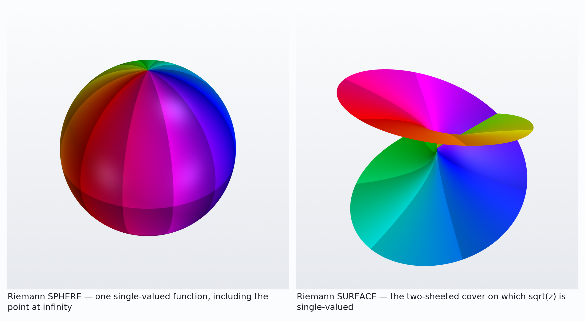</a></p>

<details>
<summary>Show the code</summary>

```python
import complexplorer as cp
preset = cp.catalog.get("reciprocal")
cp.riemann_pv(preset.func, cmap=preset.colormap())   # the SPHERE
cp.riemann_surface_pv("power", n=2)                  # the SURFACE
```

</details>

### Cube root

Principal-branch cube root; an order-3 branch point at 0 (three sheets).

<p><a href="../../examples/gallery/cbrt/portrait.png"></a> <a href="../../examples/gallery/cbrt/surface.png"></a></p>

<details>
<summary>Show the code</summary>

```python
import complexplorer as cp
preset = cp.catalog.get("cbrt")   # f(z) = z**(1/3)
cp.plot(preset.domain(), preset.func, cmap=preset.colormap())

# ---
import complexplorer as cp
cp.riemann_surface_pv("power", n=3)   # z**(1/3)
```

</details>

### Natural log

Principal-branch logarithm; a logarithmic (infinite-order) branch point at 0.

<p><a href="../../examples/gallery/log/portrait.png"></a> <a href="../../examples/gallery/log/surface.png"></a></p>

<details>
<summary>Show the code</summary>

```python
import complexplorer as cp
preset = cp.catalog.get("log")   # f(z) = log(z)
cp.plot(preset.domain(), preset.func, cmap=preset.colormap())

# ---
import complexplorer as cp
cp.riemann_surface_pv("log", r_max=3.0)   # log(z)
```

</details>

### Square root

Principal-branch square root; an order-2 branch point at 0 (two sheets).

<p><a href="../../examples/gallery/sqrt/ornament.png"></a> <a href="../../examples/gallery/sqrt/portrait.png"></a> <a href="../../examples/gallery/sqrt/surface.png"></a></p>

<details>
<summary>Show the code</summary>

```python
import complexplorer as cp
preset = cp.catalog.get("sqrt")   # f(z) = sqrt(z)
sc = preset.scaling()
cp.riemann_pv(preset.func, cmap=preset.colormap(),
              modulus_mode=sc["method"], modulus_params=sc["params"])  # relief

# ---
import complexplorer as cp
preset = cp.catalog.get("sqrt")   # f(z) = sqrt(z)
cp.plot(preset.domain(), preset.func, cmap=preset.colormap())

# ---
import complexplorer as cp
cp.riemann_surface_pv("power", n=2)   # sqrt(z)
```

</details>

## Engineering mode

A transfer function is a complex function, so the whole library applies to it.

### Engineering mode: a notch filter

One stable transfer function in four views. The zeros sit exactly on the jw axis at +-2j — the notch — while the poles stay inside the left half-plane. The portrait shows where they are; Bode and Nyquist show what they do to a signal.

<p><a href="../../examples/gallery/_tour/engineering_figure.png">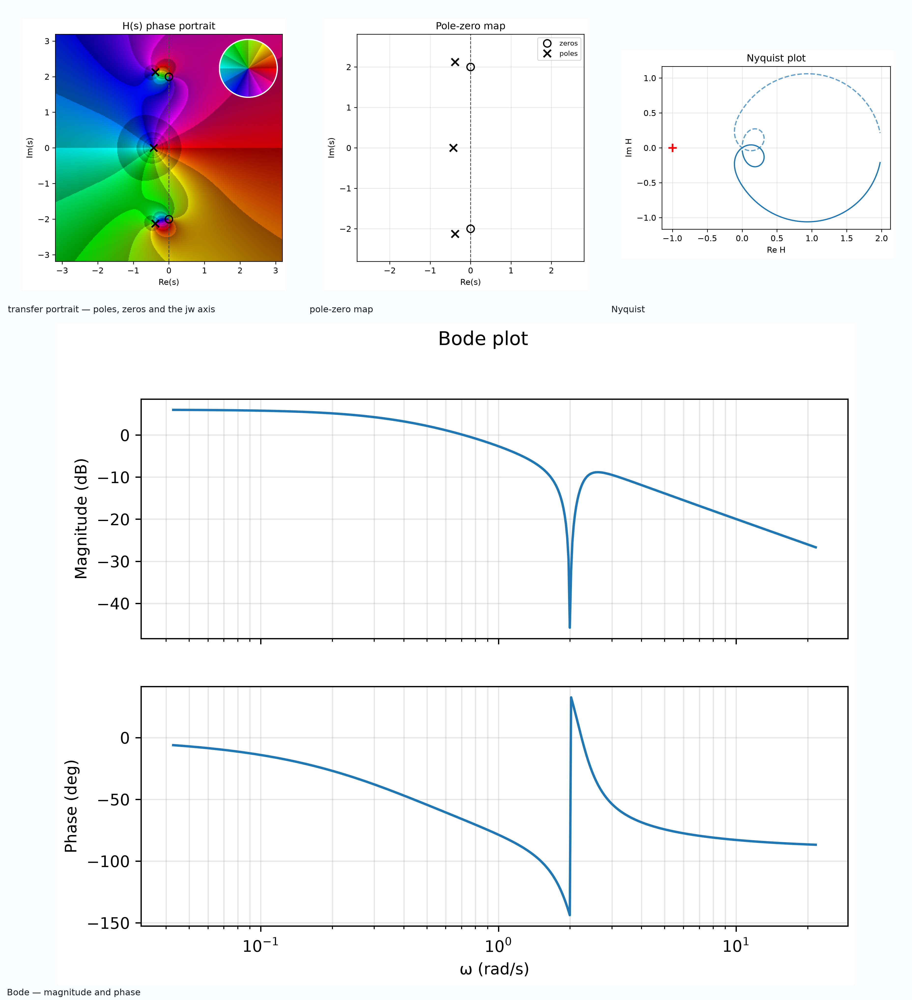</a></p>

<details>
<summary>Show the code</summary>

```python
import complexplorer as cp
H = cp.ee.TransferFunction([1, 0, 4], [1, 1.2, 5, 2])   # a notch at w = 2
cp.ee.transfer_portrait(H, legend=True)
cp.ee.pole_zero_plot(H)
cp.ee.bode_plot(H)
cp.ee.nyquist_plot(H)
```

</details>

### A transfer function is just a complex function

`TransferFunction` is a plain callable, so the engineering view and the general 3D renderer are looking at the same object. Nothing converts between them: the notch that reads as a dark point on the left is the valley on the right.

<p><a href="../../examples/gallery/_tour/composition_proof.png">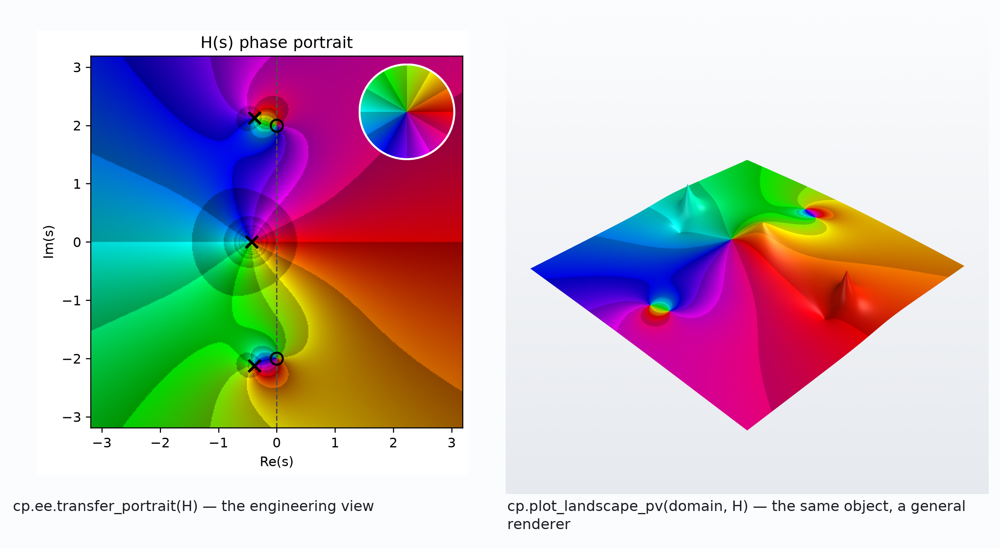</a></p>

<details>
<summary>Show the code</summary>

```python
import complexplorer as cp
H = cp.ee.TransferFunction([1, 0, 4], [1, 1.2, 5, 2])
cp.ee.transfer_portrait(H, legend=True)      # the engineering view
cp.plot_landscape_pv(cp.Rectangle(6, 6), H)  # the same object, a general renderer
```

</details>

## Colormaps

One reference function under every colormap the package exports.

### Every colormap on (z**2 - 1) / (z**2 + 1)

The same function under each colormap the package exports.

<p><a href="../../examples/gallery/_colormaps/phase_basic.png"></a> <a href="../../examples/gallery/_colormaps/phase_enhanced.png">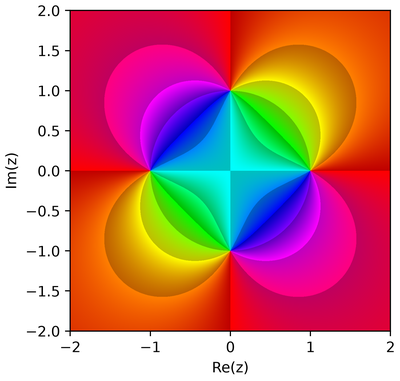</a> <a href="../../examples/gallery/_colormaps/phase_modulus.png"></a> <a href="../../examples/gallery/_colormaps/phase_full.png"></a> <a href="../../examples/gallery/_colormaps/oklab_phase.png">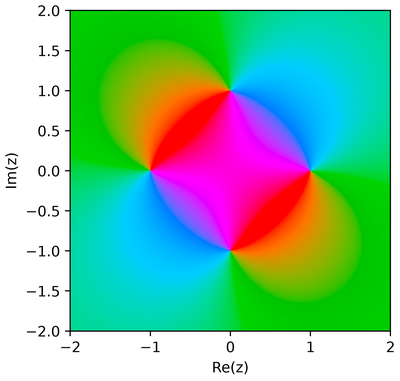</a> <a href="../../examples/gallery/_colormaps/perceptual_pastel.png">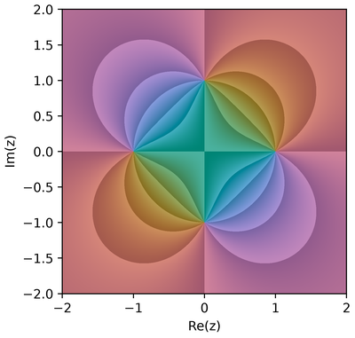</a> <a href="../../examples/gallery/_colormaps/analogous_wedge.png">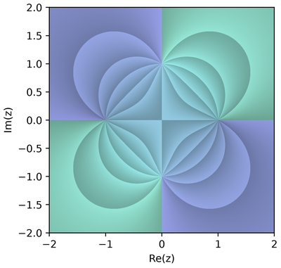</a> <a href="../../examples/gallery/_colormaps/diverging_warm_cool.png">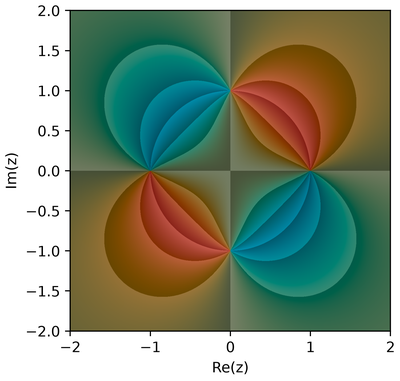</a> <a href="../../examples/gallery/_colormaps/isoluminant.png">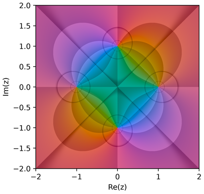</a> <a href="../../examples/gallery/_colormaps/cubehelix_phase.png">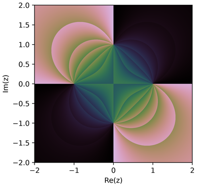</a> <a href="../../examples/gallery/_colormaps/ink_paper.png">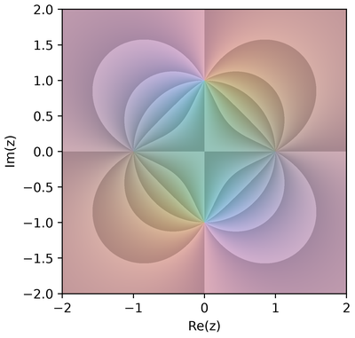</a> <a href="../../examples/gallery/_colormaps/earth_topographic.png">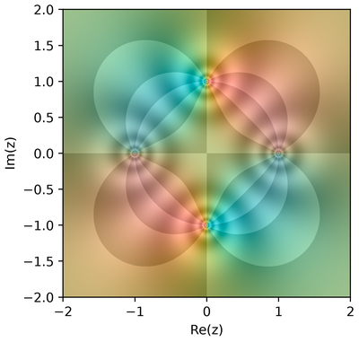</a> <a href="../../examples/gallery/_colormaps/four_quadrant.png">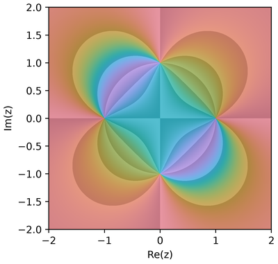</a> <a href="../../examples/gallery/_colormaps/chessboard.png">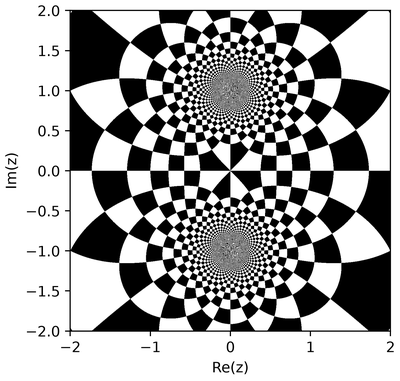</a> <a href="../../examples/gallery/_colormaps/polar_linear.png"></a> <a href="../../examples/gallery/_colormaps/polar_log.png"></a> <a href="../../examples/gallery/_colormaps/logrings.png"></a></p>

<details>
<summary>Show the code</summary>

```python
import complexplorer as cp
preset = cp.catalog.get("rational_zeros_poles")
cp.plot(preset.domain(), preset.func, cmap=cp.Phase())
```

</details>

## Physical output

Modulus-scaled relief, exported as a watertight mesh and printed.

### From function to printed object

The relief is the mathematics, the mesh is the geometry that survives losing the colour, and the print is the object on a desk. Ten poles become ten spikes around the central zero.

<p><a href="../../examples/gallery/_tour/physical_triptych.png">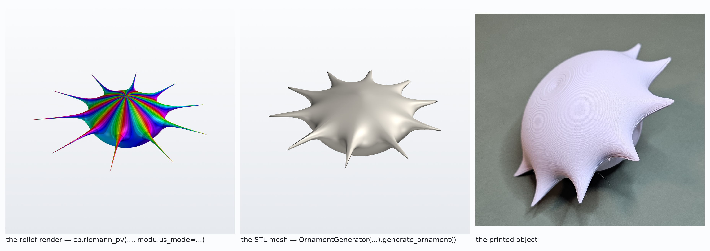</a></p>

<details>
<summary>Show the code</summary>

```python
import complexplorer as cp
from complexplorer.export.stl import OrnamentGenerator
preset = cp.catalog.get("pole_flower_10")
sc = preset.scaling()
cp.riemann_pv(preset.func, cmap=preset.colormap(),
              modulus_mode=sc["method"], modulus_params=sc["params"])
OrnamentGenerator(preset.func, resolution=150, scaling=sc["method"]).generate_and_save(
    "pole_flower.stl", size_mm=80)
```

</details>

### It rotates

A still cannot show depth or how the light moves across the spikes. Every 3D view in the library is an interactive PyVista window; this is 36 frames of one.

<p><a href="../../examples/gallery/_tour/orbit_loop.gif">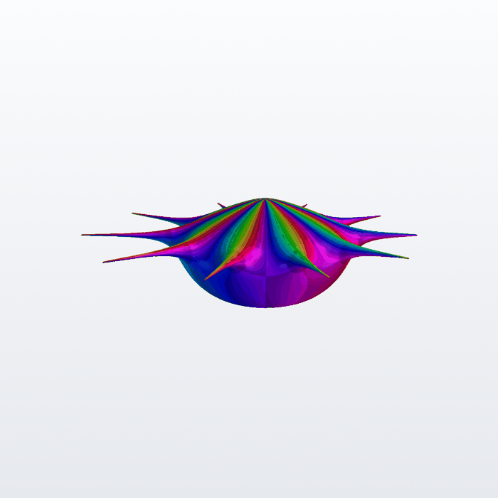</a></p>

<details>
<summary>Show the code</summary>

```python
import complexplorer as cp
preset = cp.catalog.get("pole_flower_10")
sc = preset.scaling()
# interactive=True (the default) opens a window you can rotate, zoom and light
cp.riemann_pv(preset.func, cmap=preset.colormap(),
              modulus_mode=sc["method"], modulus_params=sc["params"])
```

</details>

### Pole Flower 10

A ring of ten simple poles (the 10th roots of unity) around a central simple zero. The signature printable ornament.

<p><a href="../../examples/gallery/pole_flower_10/landscape.png"></a> <a href="../../examples/gallery/pole_flower_10/ornament.png"></a> <a href="../../examples/gallery/pole_flower_10/portrait.png"></a> <a href="../../examples/gallery/pole_flower_10/sphere.png"></a></p>

<details>
<summary>Show the code</summary>

```python
import complexplorer as cp
preset = cp.catalog.get("pole_flower_10")   # f(z) = z / (z**10 - 1)
sc = preset.scaling()
cp.plot_landscape_pv(preset.domain(), preset.func, cmap=preset.colormap(),
                     modulus_mode=sc["method"], modulus_params=sc["params"])

# ---
import complexplorer as cp
preset = cp.catalog.get("pole_flower_10")   # f(z) = z / (z**10 - 1)
sc = preset.scaling()
cp.riemann_pv(preset.func, cmap=preset.colormap(),
              modulus_mode=sc["method"], modulus_params=sc["params"])  # relief

# ---
import complexplorer as cp
preset = cp.catalog.get("pole_flower_10")   # f(z) = z / (z**10 - 1)
cp.plot(preset.domain(), preset.func, cmap=preset.colormap())

# ---
import complexplorer as cp
preset = cp.catalog.get("pole_flower_10")   # f(z) = z / (z**10 - 1)
cp.riemann_pv(preset.func, cmap=preset.colormap())   # full sphere
```

</details>
